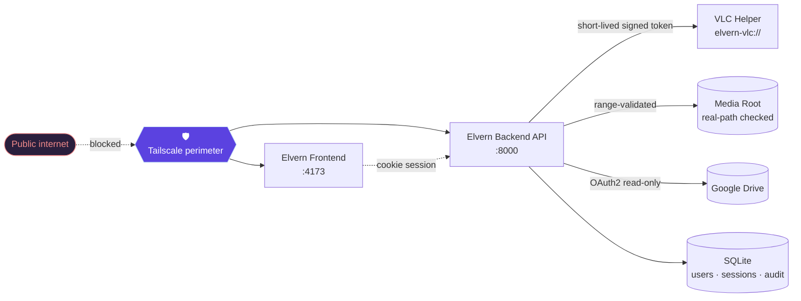
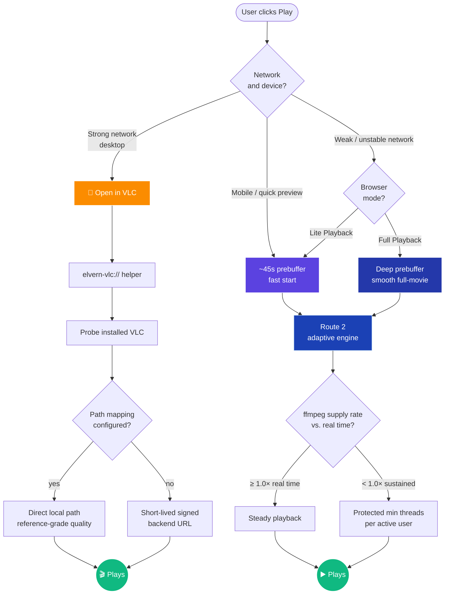

<!--
  ███████╗██╗    ██╗   ██╗███████╗██████╗ ███╗   ██╗
  ██╔════╝██║    ██║   ██║██╔════╝██╔══██╗████╗  ██║
  █████╗  ██║    ██║   ██║█████╗  ██████╔╝██╔██╗ ██║
  ██╔══╝  ██║    ╚██╗ ██╔╝██╔══╝  ██╔══██╗██║╚██╗██║
  ███████╗███████╗╚████╔╝ ███████╗██║  ██║██║ ╚████║
  ╚══════╝╚══════╝ ╚═══╝  ╚══════╝╚═╝  ╚═╝╚═╝  ╚═══╝
  A secure, privately hosted media library
  that allows fluent playback even under bad web conditions.
-->

<div align="center">


# Elvern

### Your private cinema, on your network, on your terms.

**A secure, self-hosted media library built for families.<br/>Fluent 4K/8K playback even under bad web conditions.**

<br/>

<a href="#"></a>
<a href="#"></a>
<a href="LICENSE"></a>

<a href="#"></a>
<a href="#"></a>
<a href="#"></a>
<a href="#"></a>
<a href="#"></a>
<a href="#"></a>
<a href="#"></a>

<br/>

<sub>
  <a href="#-why-elvern">Why Elvern</a> &nbsp;·&nbsp;
  <a href="#-security--the-tailscale-perimeter">Security</a> &nbsp;·&nbsp;
  <a href="#-the-playback-engine">Playback</a> &nbsp;·&nbsp;
  <a href="#-feature-tour">Features</a> &nbsp;·&nbsp;
  <a href="#-quick-start">Quick Start</a> &nbsp;·&nbsp;
  <a href="#-configuration">Configuration</a> &nbsp;·&nbsp;
  <a href="#-architecture">Architecture</a> &nbsp;·&nbsp;
  <a href="#-roadmap">Roadmap</a>
</sub>

</div>

<br/>

---

## ✦ Why Elvern

Elvern is a private, family-scale media server that takes the parts of self-hosted streaming that *should* feel premium — quality, reliability, and control — and stops compromising on them.

Most home-server stacks force a choice: stream through a browser and surrender to codec limits and stutter, or hand off to a player and lose your library context. Elvern refuses the trade. It runs a sophisticated **adaptive playback engine** for the browser path, **hands off cleanly to installed VLC** when you want reference-grade quality, and keeps everything wrapped behind a **private Tailscale-only perimeter** so the only people who can ever see your library are the ones you invited.

It is built for the way people actually watch movies at home: a parent putting a 4K HDR remux on the living-room TV, a kid resuming a cartoon on a tablet upstairs, an admin checking who's streaming what — without any of that traffic ever crossing the public internet.

<div align="center">
<br/>

```
┌──────────────────┐    private tailnet    ┌──────────────────┐
│                  │ ⟵━━━━━━━━━━━━━━━━━⟶ │                  │
│   Family device  │     fluent 4K/8K      │  Elvern host     │
│  (TV / phone /   │      VLC handoff      │  FastAPI + React │
│   laptop / Mac)  │      no public net    │  ffmpeg pipeline │
│                  │                       │  SQLite library  │
└──────────────────┘                       └──────────────────┘
```

</div>

<br/>

---

## ⚡ Highlights

<table>
<tr>
<td width="50%" valign="top">

### 🔐 Zero public surface
Sits entirely on your Tailscale tailnet. No reverse proxy to harden, no port-forward to scan, no public DNS to leak. If you weren't invited to the network, Elvern doesn't exist for you.

### 🎬 4K & 8K, full quality
Native direct-play for browser-friendly containers. Smart HLS fallback for everything else. Hands off to **installed VLC** for reference-grade 4K HDR, Atmos, DTS-HD MA — anything VLC can decode, Elvern can deliver.

### 🌊 Fluent under bad networks
Two-mode browser playback: **Lite** starts in seconds, **Full** waits for a deep prebuffer before going. The Route 2 adaptive engine watches your playback runway in real time and steers transcoder threads to where they're actually needed.

### 🧠 Smart resource adapter
Per-user thread floors, CPU upper bounds, donor-reclaim phases, and external-workload detection. Multiple users can stream concurrently without one greedy session starving the others.

</td>
<td width="50%" valign="top">

### 🎯 External-app handoff
First-class `Open in VLC` on Linux, Windows, and macOS via a signed `elvern-vlc://` URL scheme. Your library context stays in Elvern; the actual decoding stays in VLC.

### 📊 ffmpeg telemetry, exposed
Live transcode jobs, segment counts, manifest-complete states, supply-rate runway — Elvern reports it all, so you can actually *see* why a stream is slow instead of guessing.

### 🪄 Smart-scrubbing titles
A 1,200-line title parser cleans up the worst filename garbage the internet has to offer. `Movie.Name.2023.2160p.UHD.BluRay.x265.HDR.DV.Atmos-GROUP.mkv` becomes *Movie Name (2023)* with a Diamond-tier quality badge.

### 🗂️ Multi-storage pipelines
Local disk *and* Google Drive, side by side, in the same library. Read-only OAuth2 with range-aware streaming so cloud playback feels native.

### 🏆 Six-tier quality ranking
Diamond → Gold → Silver → Iron → Bronze → Wood. At a glance, you know whether that copy is reference-grade or a convenience fallback.

### 👤 Family-grade admin
Multi-user accounts, per-user resume points, session revocation, account disable, and a durable audit trail of who watched what, when.

</td>
</tr>
</table>

<br/>

---

## 🛡️ Security & the Tailscale perimeter

> **Elvern's threat model is simple: if you can't reach the tailnet, you can't reach Elvern.**
> Everything else is defense in depth on top of that single, decisive boundary.

<br/>

<div align="center">



</div>

### The private-network layer

Elvern is designed to be **deployed onto a private Tailscale (or equivalent WireGuard) network** and never exposed to the public internet. The systemd units even declare `After=tailscaled.service`, so the API doesn't come up until your tailnet is ready. The default config sets `ELVERN_PRIVATE_NETWORK_ONLY=true` and the canonical install pattern is one DGX/server host on the tailnet, accessed by family devices through tailnet hostnames.

There is no public sign-up flow, no federation, no anonymous sharing link. The product *cannot* be used as a public streaming service — that's a feature, not a limitation.

### The application layer

| Control | Implementation |
|---|---|
| **Password hashing** | PBKDF2-SHA256, **600,000 iterations** (OWASP recommended floor), per-user 16-byte random salt |
| **Sessions** | Server-side rows in SQLite, signed with a 64-char hex `ELVERN_SESSION_SECRET`, configurable TTL (default 30 days), `HttpOnly` + `Secure` cookies |
| **Brute-force protection** | Token-bucket rate limiter on `/login` — default 10 attempts / 5-minute window, then a 10-minute lockout |
| **VLC handoff tokens** | Short-lived (default **5 minutes**), bound to the requesting Elvern session, signed, single-use |
| **Path validation** | Every media path is real-path resolved and verified to be inside `ELVERN_MEDIA_ROOT` before it can stream — symlink escapes are caught |
| **Cookie security** | Auto-flips between `Secure` and dev-mode based on whether `ELVERN_PUBLIC_APP_ORIGIN` is `https://` |
| **No raw URLs** | Browsers never see filesystem paths. Helpers never see raw filesystem browsing. The opaque handoff is the only thing that crosses the wire |
| **Multi-user isolation** | Per-user roles (`admin` / `standard_user`), per-user resume state, per-user session listings, per-user assistant access flags |

### The admin layer

Every privileged action is logged to a durable audit table — logins, password changes, session revocations, user enable/disable, playback handoffs, assistant request triage. Admins can:

- 🟢 Create or invite family accounts
- 🔴 Disable an account without deleting its history (resume points stay intact for reactivation)
- ⚡ **Revoke any active session in real time** — a yanked session is dead before the next API call
- 🧾 Inspect the audit trail of recent security-relevant events
- 📊 Watch live transcode jobs, transport state, and resource-adapter decisions
- 🛠️ Triage requests submitted through the in-app assistant workflow

<br/>

---

## 🎬 The Playback Engine

> **The hardest problem in self-hosted streaming isn't getting the bytes from disk to screen.<br/>It's getting them there *fluently*, on whatever device the user picked, over whatever network they happen to have today.**

Elvern solves this by giving you **two playback planes** and letting the moment dictate which one is right.

<br/>

<div align="center">



</div>

### Plane 1 — `Open in VLC` (the desktop premium path)

This is the path you reach for when network conditions are good and you want **reference-grade quality with zero compromise**. Elvern keeps the browsing, search, detail-page, and resume context; VLC takes over the actual decoding. You get full HDR / Dolby Vision / Atmos / DTS-HD MA, file-native seeking, native subtitle track switching — all the things browser playback can never quite match.

The handoff itself is a tightly-engineered piece of plumbing:

1. You click **Open in VLC** in the browser.
2. The frontend asks the backend to mint a short-lived signed `elvern-vlc://` handoff URL (default TTL: 5 minutes).
3. Your OS hands the URL to the registered Elvern helper — a tiny .NET 8 application that ships as a portable bundle for **Windows (`win-x64`)**, **macOS (`osx-arm64` / `osx-x64`)**, and **Linux**.
4. The helper probes for installed VLC (`/usr/bin/vlc`, `C:\Program Files\VideoLAN\VLC\vlc.exe`, `/Applications/VLC.app`, etc.).
5. The helper resolves the handoff against `ELVERN_BACKEND_ORIGIN` and gets back **either a mapped direct filesystem path** (reference quality, zero transcoding) **or a short-lived backend URL fallback** (when no path mapping exists for that platform).
6. VLC launches with the resolved target, and the helper reports the launch state back to Elvern so the UI can update.

The whole flow is opaque to the browser — filesystem paths *never* leak into the web frontend, even briefly.

#### Per-platform path mapping

The same media file lives at different paths on different desktops. Elvern handles that natively:

```bash
ELVERN_LIBRARY_ROOT_LINUX="/srv/media/movies"
ELVERN_LIBRARY_ROOT_WINDOWS="Z:\\Movies"
ELVERN_LIBRARY_ROOT_MAC="/Volumes/Movies"
```

Each desktop gets the path *that desktop* can actually open.

### Plane 2 — Browser playback (the universal fallback)

Sometimes you're on hotel Wi-Fi. Sometimes you're on a phone. Sometimes the file is an exotic codec your browser refuses to touch. The browser plane has to *just work* in all of those situations — and Elvern's does.

#### Two modes, deliberate trade-offs

<table>
<tr>
<td width="50%" valign="top">

#### ⚡ Lite Playback
**Optimized for fast start.**

Begins playing once roughly the first **45 seconds** of content are ready in the buffer. Best for:

- Quick previews
- Mobile devices
- "Just put something on" moments
- Constrained networks where Full would never finish prebuffering

</td>
<td width="50%" valign="top">

#### 🎯 Full Playback
**Optimized for whole-movie smoothness.**

Waits for a deeper prebuffer (target ~120 s of healthy supply) before attaching, then maintains a real-time runway throughout playback. Best for:

- Sit-down movie nights
- Long-form content
- Networks that can sustain it
- Avoiding mid-film rebuffering

</td>
</tr>
</table>

#### Route 2 — the adaptive engine

The hard part of browser playback isn't deciding when to start — it's keeping the stream healthy *for two hours* while CPU pressure, network jitter, and other concurrent users all change underneath you.

Elvern's **Route 2 adaptive engine** is a 660-line resource controller wired into the transcoder. Its job is to make sure that, at any moment, your stream is producing **more than 1 second of ready runway per 1 second of watching** — a sustained `≥ 1.0×` supply ratio is healthy; mature supply below `1.05×` is a warning; below `1.0×` triggers active-stream protection.

Key Route 2 behaviors:

- **Per-user protected floor** — every active playback session is guaranteed a minimum of 2 worker threads (`ELVERN_ROUTE2_PROTECTED_MIN_THREADS_PER_ACTIVE_USER`), so a new user joining can never starve someone already watching.
- **CPU budget ceiling** — the entire engine is capped at a configurable percentage of host CPU (default 90%), so Elvern never hogs the box.
- **External-workload awareness** — the controller distinguishes between Elvern-owned ffmpeg helpers and *external* ffmpeg/CPU pressure, and yields capacity to non-Elvern workloads automatically.
- **Admission control** — when capacity is genuinely tight, new sessions get a clean `server_max_capacity` response with a useful diagnostic, rather than degrading every existing stream.
- **Donor reclaim phases** *(behind feature flags, conservatively gated)* — a future-aware framework for safely transferring threads from over-provisioned sessions to ones that need them, with rollback semantics that always restore the donor first.
- **Replacement-epoch architecture** — running ffmpeg processes can't have `-threads` mutated mid-flight; Route 2 handles tier changes by spawning a new epoch and swapping atomically (default cap: 3 replacement epochs per session).

#### Direct-play vs. HLS

Elvern checks the file's container, codecs, and the requesting browser's capabilities. If the browser can directly play the file, it does — no transcoding, no quality loss, no CPU spent. If not, ffmpeg fires up an HLS pipeline (cached under `ELVERN_TRANSCODE_DIR` with a configurable TTL) and serves it transparently.

### Resume that actually works

Per-user, per-item resume points stored server-side in SQLite. Pause on the TV, open the same movie on your phone an hour later, and Elvern picks up exactly where you left off — even after the VLC plane took over and finished the second half. Per-user means *truly per-user*: kids and parents can be in the same movie at completely different points without stomping each other.

<br/>

---

## ✨ Feature Tour

### 🪄 Smart-scrubbing title parser

The internet's filenames are a war crime. Elvern's title parser is the cease-fire.

<table>
<tr>
<td><b>What you have on disk</b></td>
<td><b>What Elvern shows in the library</b></td>
</tr>
<tr>
<td><code>Inception.2010.2160p.UHD.BluRay.x265.HDR.DV.TrueHD.7.1.Atmos-FraMeSToR.mkv</code></td>
<td>Inception <i>(2010)</i> — <b>💎 Diamond</b></td>
</tr>
<tr>
<td><code>The.Matrix.1999.4K.REMUX.HDR10.x265.DTS-HD.MA.5.1.mkv</code></td>
<td>The Matrix <i>(1999)</i> — <b>💎 Diamond</b></td>
</tr>
<tr>
<td><code>my movie [1080p] (web-dl).x264.AAC.mp4</code></td>
<td>My Movie — <b>🥈 Silver</b></td>
</tr>
</table>

The parser handles year detection, bracket groups, smart title-casing (with a configurable stopword list — *the*, *of*, *and*, etc.), Roman numerals, contraction suffixes, and an exhaustive set of metadata tokens (resolution, source, codec, audio, HDR formats, group tags). It keeps the canonical title clean and feeds the metadata into the quality ranker.

### 🏆 Six-tier quality ranking

Composite scoring across **source × resolution × codec × audio**:

| Tier | Score | Typical match |
|---|---|---|
| **💎 Diamond** | 15+ | 2160p UHD BluRay REMUX, HDR10/DV, Atmos/TrueHD/DTS-HD MA |
| **🥇 Gold** | 11–14 | 2160p WEB-DL HDR, or 1080p BluRay REMUX with lossless audio |
| **🥈 Silver** | 7–10 | 1080p BluRay/WEB-DL, x265, DDP/DTS |
| **⚙️ Iron** | 5–6 | 1080p WEBRip, or 720p BluRay |
| **🥉 Bronze** | 3–4 | 720p WEBRip, lower-bitrate convenience copies |
| **🌳 Wood** | < 3 | Basic SD or unidentified fallback |

Sort and filter your library by tier. Know at a glance which copy of *Blade Runner 2049* is the reference one and which one was for the kids' tablet.

### 🎨 The 1080p poster pack

No movie posters? No problem. Elvern ships with **a curated pack of 500 unique 1080p movie posters** ready to drop into your library — every poster pre-sized, optimized, and matched to its title via Elvern's normalization layer. Just unpack into the poster directory and Elvern picks them up on the next scan.

The display layer goes a step further: Pillow-based on-the-fly resizing, configurable max width (`ELVERN_POSTER_CARD_CACHE_MAX_WIDTH`, default 1400px), JPEG quality control (default 97 — basically visually lossless), and a persistent cache so you pay the cost once.

### 🗂️ Multi-storage library — local + Google Drive

Your library can live in more than one place. Elvern treats local disk and **Google Drive** as first-class peers:

- **Local sources** — recursive `ffprobe` scan, mtime-aware freshness, all the things a library scanner should do.
- **Google Drive sources** — full OAuth2 flow with read-only `drive.readonly` scope, range-aware streaming with 8MB chunks for fluent seeking, automatic re-auth flow when tokens expire, quota-error handling that surfaces meaningful messages instead of crypticness.

Mount your archive on a NAS *and* keep a working set on Drive — Elvern shows them in one library, with a single search, single resume state, and a single playback experience.

> ⚙️ Drive integration requires you to register your own Google OAuth client (free) and set `ELVERN_GOOGLE_OAUTH_CLIENT_ID` / `ELVERN_GOOGLE_OAUTH_CLIENT_SECRET`. Setup walkthrough lives in `docs/setup.md`.

### 🤖 The Assistant workflow *(beta)*

Family members can submit structured requests right inside Elvern — bug reports, improvement suggestions, account requests, library issues, playback issues, security concerns. The admin gets a triage queue with urgency levels, risk ratings, reversibility-impact tagging, and proposed-action records. Each request supports up to 8 MB of attachments (screenshots, log snippets) with a separate viewer page.

Currently in beta and gated by a per-user access flag — admins decide who gets to use it.

### 🧰 Operational extras

- **PWA installable** — the React frontend is a Progressive Web App with manifest, service worker, and proper icon set. Add it to a home screen and it behaves like a native app.
- **Health checks built in** — `GET /health` on both backend (8000) and frontend (4173). The installer's smoke test hits both before declaring success.
- **Backup checkpoints** — `scripts/create-backup-checkpoint.sh`, `inspect-backup-checkpoint.sh`, `prune-backup-checkpoints.sh` give you a clean way to snapshot SQLite state before risky operations.
- **Diagnostics scripts** — `elvern-title-diagnostics.py`, `elvern-infuse-diagnostics.py`, `elvern-core-backend-deadcheck.py`, `elvern-core-browser-deadcheck.py`, plus a full Route 2 benchmark harness.
- **Comprehensive test suite** — `pytest` with playback contracts, security, scan freshness, poster matching, title parser fixtures, route2 admission, and API smoke tests.

<br/>

---

## 🚀 Quick Start

### Path A — Linux host (recommended for daily use)

The friendly installer prompts for everything, hashes your admin password securely, writes the env file, installs systemd units, and runs a health-check smoke test:

```bash
git clone https://github.com/Sectum2010/Elvern.git /opt/elvern
cd /opt/elvern
./install.sh --install-packages --enable-now
```

That's it. After it completes:

```bash
./scripts/elvern-start.sh --open-browser
```

#### Useful installer flags

```bash
./install.sh --help                              # full help
./install.sh --dry-run                           # preview without writing anything
./install.sh --unattended \                      # CI/automation mode
  --media-root /srv/media/movies \
  --app-origin https://media.tailnet.ts.net \
  --backend-origin http://media-host:8000 \
  --admin-username admin \
  --admin-password 'replace-me' \
  --session-secret "$(openssl rand -hex 32)" \
  --install-packages --enable-now
```

#### Daily-use scripts

| Script | Purpose |
|---|---|
| `./scripts/elvern-start.sh --open-browser` | Start (or reuse) backend + frontend, open browser |
| `./scripts/elvern-control.sh` | Interactive control menu |
| `./scripts/elvern-status.sh` | Health check |
| `./scripts/elvern-restart.sh --open-browser` | Apply config / code changes |
| `./scripts/elvern-stop.sh` | Stop running services |
| `./scripts/elvern-logs.sh` | Tail recent logs |
| `./scripts/rescan.sh` | Force a library rescan |

### Path B — All-in-one Docker

For homelab folks who prefer containers:

```bash
git clone https://github.com/Sectum2010/Elvern.git
cd Elvern

# 1. Bootstrap env from the example
cp deploy/env/.env.example deploy/env/elvern.env

# 2. Edit deploy/env/elvern.env (see Configuration section below)
#    For a plain HTTP first run on host 192.168.1.10:
#      ELVERN_PUBLIC_APP_ORIGIN="http://192.168.1.10:4173"
#      ELVERN_BACKEND_ORIGIN="http://192.168.1.10:8000"
#      ELVERN_COOKIE_SECURE="false"
#      ELVERN_ADMIN_BOOTSTRAP_PASSWORD="<your-first-password>"
#      ELVERN_SESSION_SECRET="$(openssl rand -hex 32)"

# 3. Point the bind mount at your media
export ELVERN_DOCKER_MEDIA_PATH=/path/to/your/movies

# 4. Launch
docker compose up --build -d
```

Default ports:

| Service | Port | URL |
|---|---|---|
| Frontend (PWA) | `4173` | `http://<host>:4173` |
| Backend API | `8000` | `http://<host>:8000` |

The container ships `ffmpeg` and `ffprobe` baked in. SQLite, transcodes, and helper releases persist under `./docker-data/data/`. Your media is mounted **read-only** at `/media`.

### First sign-in

1. Open the frontend URL in any browser on your tailnet.
2. Sign in with the bootstrap admin credentials.
3. Click **Library → Rescan** to index your media.
4. *(optional)* Open the **Admin** page and create accounts for the rest of the family.
5. *(optional)* Install the desktop VLC helper on each playback machine — see [Desktop helper](#desktop-helper-vlc-handoff).

### Desktop helper (VLC handoff)

Build the helper bundles on the Elvern host:

```bash
cd /opt/elvern/clients/desktop-vlc-opener
./scripts/publish-bundles.sh                     # all default targets
./scripts/publish-bundles.sh --runtime win-x64   # Windows only
./scripts/publish-bundles.sh --runtime osx-arm64 # Apple Silicon Mac
```

Distributable bundles land under `clients/desktop-vlc-opener/artifacts/packages/`. Copy the right one to each desktop, install the .NET 8 runtime if it's not already there, and run the install script:

| Platform | Install command |
|---|---|
| **Windows** | Double-click `Install-ElvernVlcOpener.cmd` |
| **macOS** | Double-click `Install-ElvernVlcOpener.command` |
| **Linux** | `./scripts/register-protocol-linux.sh` |

After that, **Open in VLC** Just Works™ from any browser tab on that desktop.

<br/>

---

## ⚙️ Configuration

All runtime config lives in `deploy/env/elvern.env`. Below are the knobs that matter most. The full reference is in `deploy/env/.env.example`.

### Core

| Variable | Default | Purpose |
|---|---|---|
| `ELVERN_MEDIA_ROOT` | *required* | Absolute path to your movies directory |
| `ELVERN_DB_PATH` | `backend/data/elvern.db` | SQLite database location |
| `ELVERN_SESSION_SECRET` | *required, ≥ 32 chars* | Session signing key — generate with `openssl rand -hex 32` |
| `ELVERN_ADMIN_USERNAME` | `admin` | Bootstrap admin account name |
| `ELVERN_ADMIN_PASSWORD_HASH` | — | **Preferred.** Generate with `python -m backend.app.cli hash-password "<pw>"` |
| `ELVERN_ADMIN_BOOTSTRAP_PASSWORD` | — | Plaintext fallback (one-time bootstrap; the app hashes & discards) |
| `ELVERN_PUBLIC_APP_ORIGIN` | — | Canonical private app URL (e.g. `https://media.tailnet.ts.net`) |
| `ELVERN_BACKEND_ORIGIN` | — | Canonical private backend API URL |
| `ELVERN_COOKIE_SECURE` | `true` | Set `false` only for plain-HTTP local dev |
| `ELVERN_PRIVATE_NETWORK_ONLY` | `true` | Keep this on |

### Playback & transcoding

| Variable | Default | Purpose |
|---|---|---|
| `ELVERN_TRANSCODE_ENABLED` | `true` | HLS fallback master switch |
| `ELVERN_TRANSCODE_DIR` | `backend/data/transcodes` | Cache for HLS segments |
| `ELVERN_TRANSCODE_TTL_MINUTES` | `60` | Idle TTL before transcode caches are pruned |
| `ELVERN_MAX_CONCURRENT_TRANSCODES` | `1` | Cap on concurrent ffmpeg jobs |
| `ELVERN_BROWSER_PLAYBACK_ROUTE2_ENABLED` | `true` | Route 2 adaptive engine on/off |
| `ELVERN_PLAYBACK_TOKEN_TTL_SECONDS` | `300` | VLC handoff token lifetime |
| `ELVERN_FFMPEG_PATH` | auto-detect | Override ffmpeg binary location |
| `ELVERN_FFPROBE_PATH` | auto-detect | Override ffprobe binary location |

### Resource adapter (Route 2)

| Variable | Default | Purpose |
|---|---|---|
| `ELVERN_ROUTE2_CPU_UPBOUND_PERCENT` | `90` | Hard ceiling on Route 2's share of host CPU |
| `ELVERN_ROUTE2_PROTECTED_MIN_THREADS_PER_ACTIVE_USER` | `2` | Per-user protected thread floor |
| `ELVERN_ROUTE2_MIN_WORKER_THREADS` | `1` | Minimum worker thread pool size |
| `ELVERN_ROUTE2_MAX_WORKER_THREADS` | `min(4, cpu_count)` | Maximum worker thread pool size |
| `ELVERN_ROUTE2_ADAPTIVE_THREAD_CONTROL_ENABLED` | `false` | Enable real adaptive thread control *(advanced)* |
| `ELVERN_ROUTE2_MAX_REPLACEMENT_EPOCHS_PER_SESSION` | `3` | Cap on tier-change ffmpeg respawns per session |

### Desktop & VLC handoff

| Variable | Default | Purpose |
|---|---|---|
| `ELVERN_DESKTOP_PLAYBACK_MODE` | `vlc_direct` | Currently the only supported mode |
| `ELVERN_VLC_HELPER_PROTOCOL` | `elvern-vlc` | URL scheme registered on each desktop |
| `ELVERN_VLC_PATH_LINUX` | `/usr/bin/vlc` | Path to VLC binary on Linux |
| `ELVERN_LIBRARY_ROOT_LINUX` | inherits `MEDIA_ROOT` | Where Linux desktops see the library |
| `ELVERN_LIBRARY_ROOT_WINDOWS` | — | e.g. `Z:\\Movies` |
| `ELVERN_LIBRARY_ROOT_MAC` | — | e.g. `/Volumes/Movies` |

### Posters & quality

| Variable | Default | Purpose |
|---|---|---|
| `ELVERN_POSTER_DISPLAY_CACHE_ENABLED` | `true` | On-the-fly poster resizing |
| `ELVERN_POSTER_CARD_CACHE_MAX_WIDTH` | `1400` | Max poster width in px (400–4096) |
| `ELVERN_POSTER_CARD_CACHE_JPEG_QUALITY` | `97` | JPEG quality (85–100) |

### Login throttling

| Variable | Default | Purpose |
|---|---|---|
| `ELVERN_LOGIN_WINDOW_SECONDS` | `300` | Sliding window for attempt counting |
| `ELVERN_LOGIN_MAX_ATTEMPTS` | `10` | Attempts allowed inside the window |
| `ELVERN_LOGIN_LOCKOUT_SECONDS` | `600` | Lockout duration after threshold |

### Cloud storage *(Google Drive)*

| Variable | Default | Purpose |
|---|---|---|
| `ELVERN_GOOGLE_OAUTH_CLIENT_ID` | — | Your registered Google OAuth client ID |
| `ELVERN_GOOGLE_OAUTH_CLIENT_SECRET` | — | Your registered Google OAuth client secret |

<br/>

---

## 🏗️ Architecture

```mermaid
flowchart TB
    subgraph Clients["👥 Family devices on the tailnet"]
        Browser[Browser PWA<br/>React 18 · Vite 5]
        VlcHelper[VLC Opener<br/>.NET 8 helper]
        VlcApp[Installed VLC]
    end

    subgraph Host["🖥️ Elvern host"]
        subgraph Frontend["Frontend :4173"]
            ServerMjs[Node server.mjs<br/>static + cookies]
        end

        subgraph Backend["Backend :8000 — FastAPI"]
            Auth[auth · sessions · rate-limit]
            Library[library · scan · ffprobe]
            Routing[playback router<br/>direct-play vs HLS]
            Route2[Route 2 adaptive engine<br/>thread admission · CPU budget]
            Transcode[transcode manager<br/>ffmpeg subprocess pool]
            Mobile[mobile playback manager]
            DesktopAPI[desktop handoff<br/>signed elvern-vlc:// tokens]
            Cloud[cloud library<br/>Google Drive OAuth2]
            AdminSvc[admin · audit · events]
            Assistant[assistant beta]
            Posters[poster display cache<br/>Pillow]
        end

        subgraph Storage["Storage"]
            DB[(SQLite<br/>users · sessions · library<br/>progress · audit)]
            MediaFS[Media root<br/>real-path validated]
            TranscodeCache[Transcode cache<br/>TTL-aware]
            PosterCache[Poster cache]
        end
    end

    subgraph External["External"]
        GDrive[(Google Drive<br/>read-only OAuth2)]
    end

    Browser <-->|cookie session| ServerMjs
    Browser <-->|API + HLS| Backend
    VlcHelper -->|resolve handoff| DesktopAPI
    VlcHelper -->|launches| VlcApp
    VlcApp -->|reads| MediaFS

    Auth --> DB
    Library --> DB
    Library --> MediaFS
    Routing --> Transcode
    Routing --> Route2
    Transcode --> TranscodeCache
    Mobile --> TranscodeCache
    Cloud <-->|range streaming| GDrive
    AdminSvc --> DB
    Assistant --> DB
    Posters --> PosterCache

    style Host fill:#1b1f3a,stroke:#5b42e0,color:#fff
    style Backend fill:#2438aa,stroke:#c7e1f6,color:#fff
    style Frontend fill:#5b42e0,stroke:#fff,color:#fff
    style Route2 fill:#fb8c00,stroke:#fff,color:#fff
```

<div align="center">



</div>

### The control plane

The **FastAPI backend** at `backend.app.main:app` is the single control plane. On startup it loads settings, initializes SQLite (creating the schema if needed), ensures the bootstrap admin user, and spawns three long-lived managers:

- **`ScanService`** — recursive `ffprobe` indexer with idempotent updates
- **`TranscodeManager`** — ffmpeg subprocess pool with TTL-based cache cleanup
- **`MobilePlaybackManager`** — separate worker pool for mobile-shape sessions
- **`AdminEventHub`** — pub/sub bus for live admin events (active sessions, transcode states)

Every API surface is a versioned router under `backend/app/routes/` — auth, library, playback (browser/desktop/mobile/native), stream, progress, admin, admin_assistant, assistant, cloud_libraries, desktop_helper, debug, system, user_settings, user_hidden_items.

### The data plane

SQLite handles users, sessions, library items, per-user progress, audit log, assistant requests, hidden-item flags, cloud library sources, and adaptive-engine state. Schema migrations are deterministic and run on startup.

### The presentation plane

The frontend is a **React 18 + Vite 5 PWA** with `react-router-dom`, `hls.js` for browser HLS, and a custom Node `server.mjs` that handles production serving (static delivery, cookie passthrough, health endpoint). Service worker, manifest, and icon set ship for proper PWA installability — add it to your iPhone home screen and it behaves like a native app.

### Deeper docs

The repo carries substantial internal documentation under `docs/`:

- 📐 `docs/architecture.md` — full architecture narrative
- 🔧 `docs/setup.md` — Linux host setup walkthrough
- 🐳 `docs/docker.md` — container deployment guide
- 🛠️ `docs/operations.md` — daily-use ops manual
- 💾 `docs/backup-and-recovery.md` — backup checkpoint workflow
- 🗺️ `docs/ROADMAP.md` — what's next
- ⚡ `docs/ROUTE2_ADAPTIVE_RESOURCE_POLICY.md` — the Route 2 policy spec
- 📊 `docs/ROUTE2_ADAPTIVE_BENCHMARK_NOTES.md` — performance benchmarks
- 🎬 `docs/PLAYBACK_REGRESSION_NOTES.md` — known playback edge cases

<br/>

---

## 👤 Admin & Assistant

<table>
<tr>
<td width="50%" valign="top">

### Admin console

The admin console is the operational hub for the family deployment:

- 👥 **User management** — create, disable, re-enable, delete; per-user role (`admin` / `standard_user`) and per-user assistant beta access
- 🔑 **Session control** — list every live session across the system, see last-activity time and source IP, revoke any session in one click
- 📜 **Audit log** — durable trail of logins, password changes, session revocations, account state changes, playback handoffs, and assistant triage events
- 📡 **Live events** — Server-Sent-Events stream that surfaces real-time admin events (sessions opening, transcodes starting, etc.)
- ⚡ **Resource view** — peek into Route 2's current state: active workers, assigned threads per session, supply-rate runway, admission decisions

</td>
<td width="50%" valign="top">

### Assistant workflow *(beta)*

A structured request queue inside Elvern itself. Family members can submit:

- 🐛 Bug reports
- 💡 Improvement suggestions
- 📚 Library issues
- ▶️ Playback issues
- 🔒 Security concerns
- 👤 Account requests
- ❓ Other

Each request supports up to **8 MB of attachments** (screenshots, log snippets) viewed in a dedicated attachment viewer. Admins triage with urgency levels (`low` / `normal` / `high`), risk ratings (`low` / `medium` / `high` / `critical`), reversibility-impact tagging, and a record of proposed actions (backup checkpoint, library rescan, service restart, prepare-patch sandbox, change-record draft, admin notification).

> Beta-gated by `assistant_beta_enabled_for_user` — admins decide who gets it.

</td>
</tr>
</table>

<br/>

---

## 🗺️ Roadmap

Elvern is at **0.8.0** and actively iterating. The current direction:

### Near-term

- 🐳 Docker polish — clearer first-run experience, more robust container path
- 📖 Setup-doc and onboarding refinement so first-time self-hosted users get running faster
- 🧪 Broader backend test coverage around auth, media safety, and playback contracts
- 🛠️ Helper-installation ergonomics, especially for the desktop VLC opener flow on Windows/macOS

### Later

- ✍️ Signed helper packaging for desktop clients
- 🔍 Better playback diagnostics for desktop handoff, browser readiness, and route selection
- 💾 Backup and restore documentation for SQLite state
- 🛡️ Additional deployment hardening for self-hosted environments
- 📱 Native mobile clients reusing the existing fallback playback-session contract

### Explicitly out of scope

Elvern is **not** trying to become a public streaming service, a content-sharing or piracy platform, or a feature-for-feature Plex/Jellyfin replacement. The target is a *smaller, sharper* private control plane optimized for the family-server use case.

<br/>

---

## 🤝 Contributing

This is an early public project — issues, PRs, and discussions are all welcome:

- 🐛 [Report an issue](https://github.com/Sectum2010/Elvern/issues)
- 💬 [Start a discussion](https://github.com/Sectum2010/Elvern/discussions)
- 🔀 Open a PR against `main`

Please run the test suite before sending a PR:

```bash
. .venv/bin/activate
pytest                                           # backend
cd frontend && npm test                          # frontend (vitest)
```

<br/>

---

## 📜 License

Elvern is released under the [Apache License 2.0](LICENSE). Use it, fork it, run it on your own hardware. Just don't pretend it came from someone else.

<br/>

---

<div align="center">

<sub>Built for families. Privacy by default. Quality without compromise.</sub>

<br/>

<sub>
  <b>Elvern</b> · v0.8.0 · <a href="https://github.com/Sectum2010/Elvern">github.com/Sectum2010/Elvern</a>
</sub>

</div>
